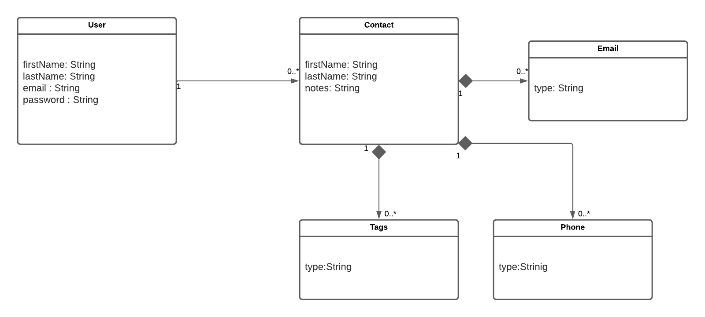

# Introduction
Hi, These are some diagrams showing how we designed the web app.

## Stack Architecture Diagram
Some of class mates were from other faculties. So I drew up this for better understanding.

## OPP Class diagram

## DatabaseModel
We used MongoDB for storing Data. 

## DeploymentDiagram
The lower half was drawm by another team mate. She was a familiar and in charge of that part, which i really want to get to know more about.

