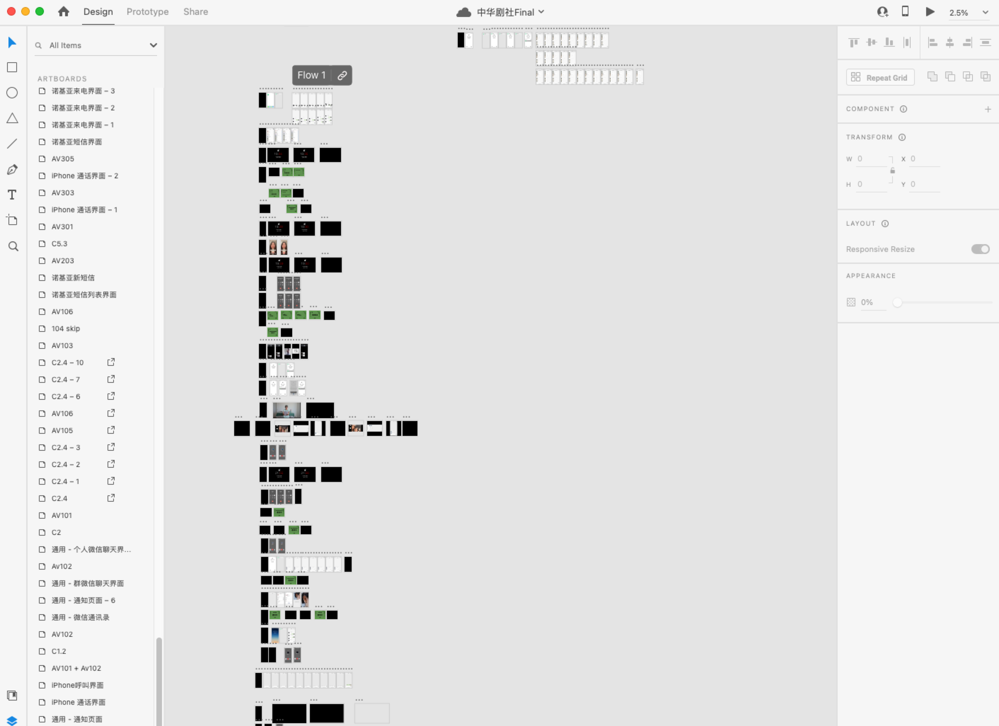

# Introduction
Hi, this is an adobe xd project I created for a student club. It took me around 50 hours for making this plus countless hours for discussion...

I was using figima before, and this project was where I mainly developed my adobe xd skills.

## The FUN parts
* AV101
* C2

* AV105

* AV309
* AV312 - AV314

* AV417

## Reason why it is not catagorised
* The pages was mainly organised via visal presentation.
* I'm the only stuff maintaning this and it doesn't matter in this project.

## Full Presentation

## LINK
https://xd.adobe.com/view/9496e939-d3ff-463e-beb7-c85664ba3e1b-c1c5/ 
